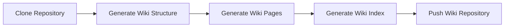

# Open Deepwiki

Automated Wiki Generation for Codebases Using LLMs

[](https://opensource.org/licenses/MIT)

## Overview

Deepwiki leverages state-of-the-art Large Language Models (LLMs) to automatically analyze your codebase and generate comprehensive Wiki documentation. It streamlines documentation workflows for development teams, enhances project maintainability, and accelerates onboarding for new contributors.

**Key Features:**

- Automated codebase analysis and structured documentation
- Generation of various document types: tutorials, references, explanations, and more
- Documentation generation based on specified branches
- Support for the latest LLMs (GPT-4.1, GPT-4o, etc.)

> **Estimated Time:** Initial setup and Wiki generation takes approximately 10 minutes.

## Inspiration

This project is inspired by [AsyncFuncAI/deepwiki-open](https://github.com/AsyncFuncAI/deepwiki-open), with improvements in pipeline and features based on its core ideas and prompt structures.

## Getting Started

### Prerequisites

```bash
# Install required packages
pip install -r requirements.txt
```

Create a `.env` file in the project root and set the following environment variables:

```bash
GITHUB_ACCESS_TOKEN=your_github_token

GOOGLE_API_KEY=your_google_api_key   # Optional, depending on the model
OPENAI_API_KEY=your_openai_api_key   # Optional, depending on the model
ANTHROPIC_API_KEY=your_anthropic_api_key # Optional, depending on the model
```

### Configuration

Create a `wiki_config.yaml` file in the project root with the following content:

```yaml
wiki:
  repository: "username/wiki-repo"
  branch: "main"
  directory: "docs"
model: "openai/gpt-4.1"
language: "English"
skip: 1m
```

### Usage

Generate Wiki documentation with the following command:

- `branch`: Specify the branch to base the Wiki on. Defaults to the main branch if not provided.
- `pat`: Your GitHub Personal Access Token for repository access.

```bash
python -m apps.main <owner>/<repository> --branch <branch_name> --pat <your_github_token>
```

### GitHub Actions Integration

#### 1. Define Secrets for GitHub Actions

Go to your repository's GitHub page.

Navigate to `Settings > Secrets and variables > Actions` and add the following secrets:

- `DEEPWIKI_GITHUB_PAT` (Personal Access Token)
  - Required scopes: `repo`, `workflow`, `admin:org`
  - Generate from `Settings > Developer settings > Personal access tokens` in your GitHub account.
- `DEEPWIKI_ENV`:
  ```bash
  GOOGLE_API_KEY=your_google_api_key   # Optional
  OPENAI_API_KEY=your_openai_api_key   # Optional
  ANTHROPIC_API_KEY=your_anthropic_api_key # Optional
  ```

#### 2. Configure GitHub Actions Workflow

Create a workflow file (e.g., `generate_wiki.yaml`) in `.github/workflows/` in your repository. See `workflows/sample_workflow.yaml` for a reference.

#### 3. Test Run

It is recommended to run in test mode first. Add `is_test: 1` to your workflow file:

```yaml
- name: Generate Wiki
  id: generate-wiki
  uses: gold24park/open-deepwiki/generate-wiki@main
  with:
    is_test: 1
    # ... other settings ...
```

#### 4. Run Actions

Go to the `Actions` tab in your GitHub repository, select the workflow, and run it. Upon successful completion, documentation will be generated in your designated Wiki repository.

## Generation Process



## Wiki Configuration Reference

The `wiki_config.yaml` file supports the following fields:

| Field             | Description                                                                          | Default / Example | Required |
| ----------------- | ------------------------------------------------------------------------------------ | ----------------- | -------- |
| `wiki.repository` | Name of the repository for Wiki generation. If not set, the same repository is used. | `None`            | -        |
| `wiki.branch`     | Branch to use for Wiki generation. If not set, the default branch is used.           | `None`            | -        |
| `wiki.directory`  | Directory to store generated Wiki files.                                             | `"/wikis"`        | -        |
| `skip`            | Period to skip Wiki generation for recently updated files.                           | `7d` (7 days)     | -        |
| `language`        | Language for the Wiki pages.                                                         | `"English"`       | -        |
| `model`           | LLM model for documentation generation.                                              | `None`            | -        |
| `ignore_patterns` | List of glob patterns to exclude from code indexing.                                 | `[]` (empty list) | -        |
| `tutorial`        | List of hints or instructions for tutorial docs.                                     | `[]` (empty list) | -        |
| `how_to`          | List of hints or instructions for how-to docs.                                       | `[]` (empty list) | -        |
| `reference`       | List of hints or instructions for reference docs.                                    | `[]` (empty list) | -        |
| `explanation`     | List of hints or instructions for explanation docs.                                  | `[]` (empty list) | -        |

### Document Types

- **Tutorial:** Beginner-friendly guides for new technologies or tools, including prerequisites and step-by-step instructions.
- **How-to:** Task-oriented guides for solving specific problems, providing actionable steps for real-world scenarios.
- **Reference:** Detailed documentation for functions, classes, and modules, aimed at users familiar with the basics.
- **Explanation:** In-depth conceptual documents covering architecture, design patterns, and rationale behind technical decisions.

## License

This project is distributed under the MIT License. You are free to use, modify, and distribute it with proper attribution.
